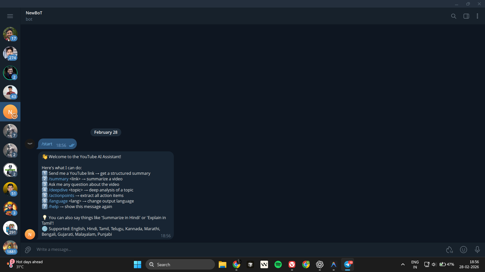
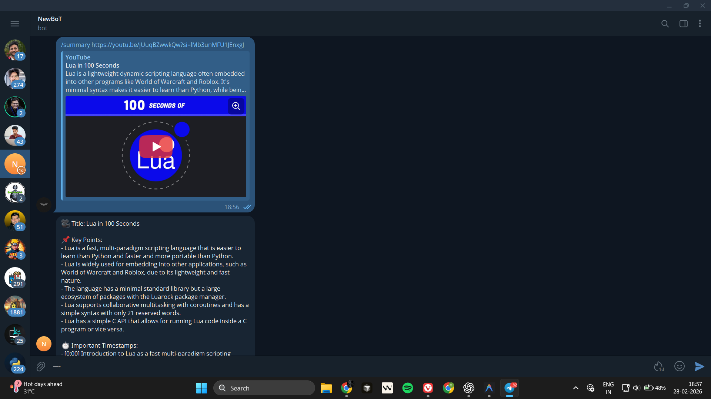
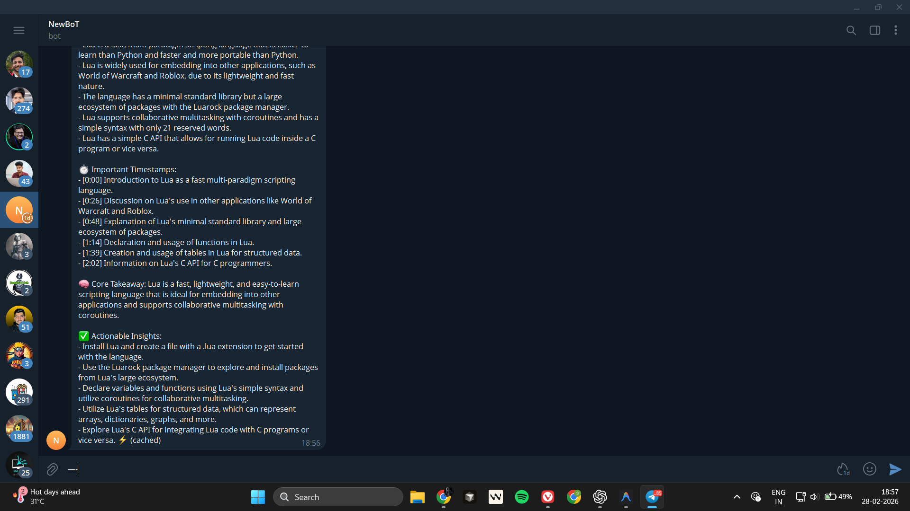
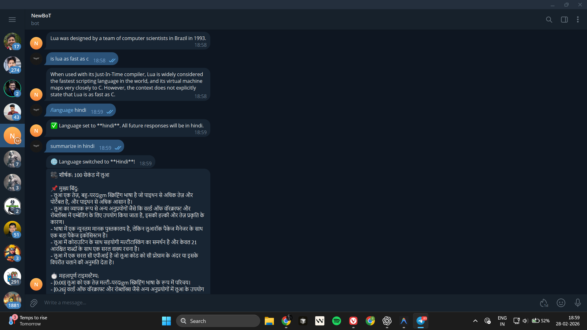
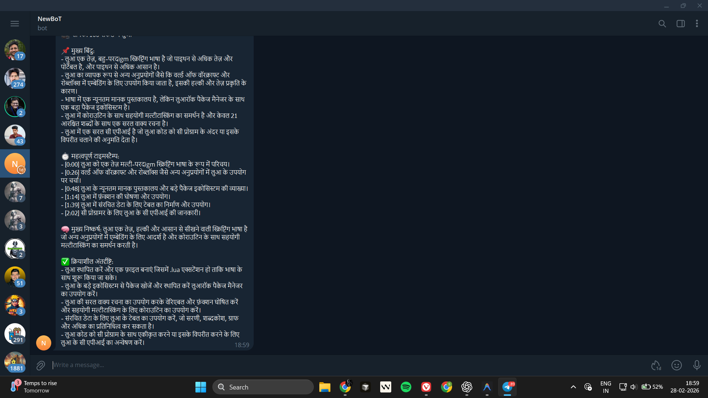
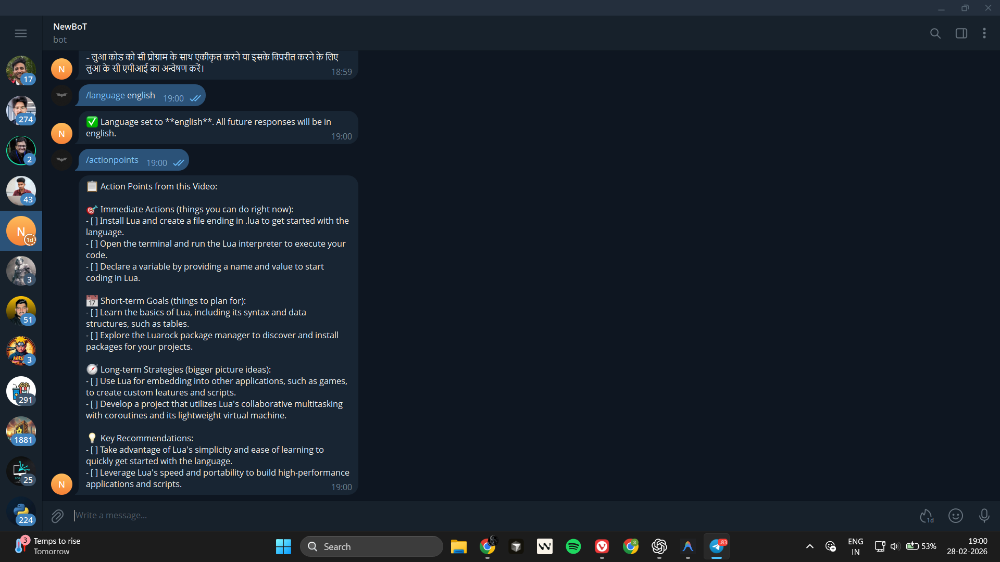
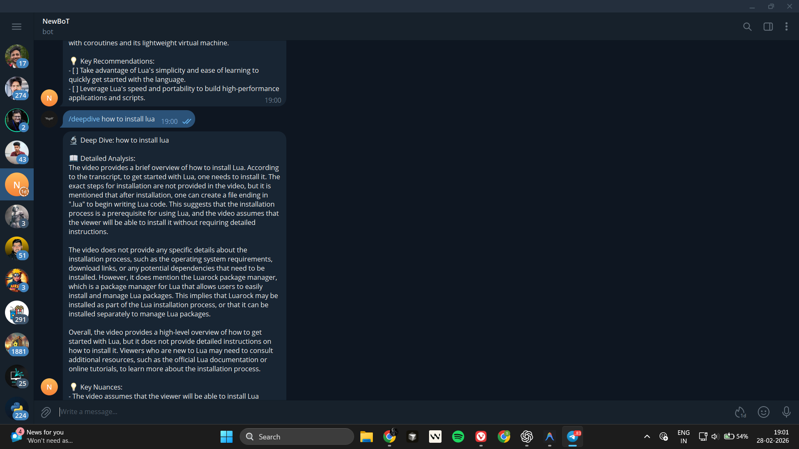
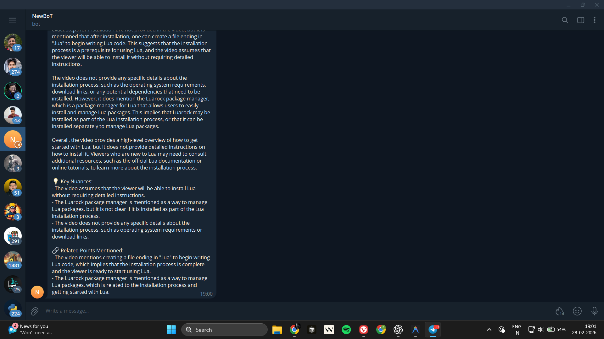
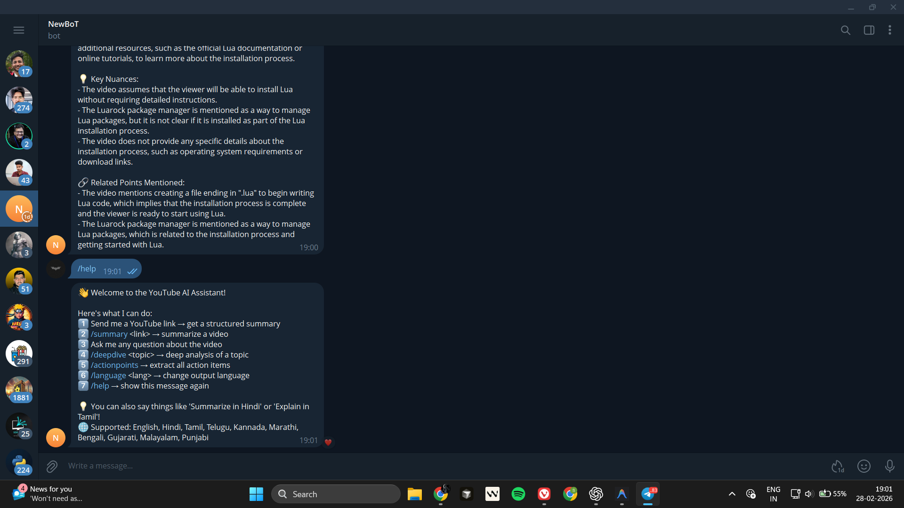

# Telegram YouTube Summarizer & Q&A Bot

A production-ready Telegram bot that acts as your personal AI research assistant for YouTube videos. It fetches transcripts, generates structured summaries, and allows you to chat with the video content using Retrieval-Augmented Generation (RAG).

**Bot Link:** [@MyYTSummarizerBot](https://t.me/MyYTSummarizerBot)

## Architecture Diagram

```ascii
                    +-------------------+
                    |   Telegram User   |
                    +---------+---------+
                              |
                              v
                    +-------------------+
                    |   Telegram API    |
                    +---------+---------+
                              | Polling
                              v
+------------------------------------------------------------------------------------+
|                       FastAPI / aiogram                                            |
|                                                                                    |
|   +---------------+   +---------------+   +-------------+                          |
|   | Bot Handlers  |   | Rate Limiter  |   | API Routes  |                          |
|   | (/start,/help |   | (Atomic Lua)  |   | (/health)   |                          |
|   |  /summary,    |   +-------+-------+   +-------------+                          |
|   |  /deepdive,   |          |                                                     |
|   |  /actionpoints|          v                                                     |
|   |  /language)   |   +-------+-------+                                            |
|   +-------+-------+   | Redis (Cache  |                                            |
|           |           | + Sessions +  |                                            |
|           v           | Rate Limits)  |                                            |
|   +-------+-------+   +---------------+                                            |
|   |  Task Queue   |                       +-------+-------+   +-------+-----+      |
|   | (Celery)      |   +-------+-------+   |   PostgreSQL  |   | Translation |      |
|   +-------+-------+   |  RAG Engine   |   |  (Videos +    |   |  Layer +    |      |
|           |           | (FAISS in     |   |   QA History) |   |  Validation |      |
|           v           |  Redis)       |   +---------------+   +-------------+      |
|   +-------+-------+   +---------------+                                            |
+-----------+------------------------------------------------------------------------+
            |
            +------------+--------------------+
            |            |                    |
            v            v                    v
      +-----+----+ +-----+----+       +-------+-------+
      |  YouTube | | Sentence |       | Groq (LLM)    |
      |Transcript| | Transf.  |       | llama-3.3-70b |
      +----------+ +----------+       | + Auto Retry  |
                                      +---------------+
```

## Why Not OpenClaw?

The assignment references "OpenClaw" as the suggested framework. After evaluating it, I chose to build a custom architecture for the following reasons:

1. **Full Architectural Control**: Building custom allowed me to make precise design decisions (RAG chunking strategy, FAISS with cosine similarity, atomic rate limiting) that would be constrained by an opinionated framework.
2. **Deep Understanding**: Building from scratch demonstrates a thorough understanding of NLP pipelines, vector search, prompt engineering, and production patterns — rather than just configuring a tool.
3. **Production Patterns**: The custom stack uses industry-standard patterns (Celery for background processing, Redis Lua scripts for atomicity, Redis-backed vector stores for multi-container deployments) that wouldn't be available through a higher-level abstraction.
4. **Transparency**: Every component is visible, testable, and maintainable — no black boxes.

The core technology stack (transcript extraction → chunking → embedding → vector search → grounded LLM generation) achieves the same end result with better control over quality, cost, and reliability.

## Features

1. **YouTube Summarization**: Send a URL and get structured summaries with title, key points, **real timestamps from the transcript**, and takeaways.
2. **Contextual Q&A**: Ask follow-up questions grounded in the transcript — strict anti-hallucination rules.
3. **Deep Dive Analysis**: Use `/deepdive <topic>` to get in-depth analysis on specific topics from the video.
4. **Action Points Extraction**: Use `/actionpoints` to extract all actionable items and recommendations.
5. **Multi-language**: Supports English and 9 Indian languages (Hindi, Tamil, Telugu, Kannada, Marathi, Bengali, Gujarati, Malayalam, Punjabi) with **input validation**.
6. **Inline Language Detection**: Say "Summarize in Hindi" or "Explain in Tamil" — no need for commands.
7. **Smart Caching**: Transcripts (24h) and summaries (24h) cached in Redis for instant re-access.
8. **Conversation Memory**: Remembers last 5 Q&A exchanges for context-aware follow-ups.
9. **Rate Limiting**: Per-user limits (5 videos/hr, 30 questions/hr) using **atomic Lua scripts** for race-free enforcement.
10. **Background Processing**: Heavy tasks run via Celery with timeout protection and exponential backoff retry.
11. **Dockerized**: Fully modular setup via Docker Compose with shared volumes.
12. **PostgreSQL Persistence**: Video records and Q&A history saved for long-term analytics.
13. **Groq API Retry**: Automatic exponential backoff retry on rate limits (429 errors).
14. **Cosine Similarity Search**: FAISS uses normalized inner product for better semantic matching.
15. **Multi-Container RAG**: Serialized FAISS indices are shared via Redis, allowing isolated API and Worker containers (e.g. on Railway) to seamlessly access the same vector data.

## How RAG Works

1. **Fetch**: Extract transcript using `youtube-transcript-api` (cached in Redis for 24h).
2. **Chunking**: The transcript is tokenized and chunked using `TokenTextSplitter` with overlap — each chunk preserves accurate timestamp metadata via character-offset mapping.
3. **Embedding**: `SentenceTransformers` (`all-MiniLM-L6-v2`) converts text into vector embeddings locally.
4. **Vector Store**: Stored in `FAISS` (cosine similarity via L2-normalized inner product) and persisted as serialized bytes in **Redis** with a 24-hour TTL, enabling isolated web and worker containers to instantly access RAG memory without needing a shared persistent volume.
5. **Retrieval**: Top-k semantic search extracts the most relevant chunks for Q&A (5 for questions, 8 for deep dives, 10 for action points).
6. **Generation**: Context + conversation history fed into Groq's `llama-3.3-70b-versatile` with strict anti-hallucination grounding rules and automatic retry on rate limits.

## Setup Steps

1. Clone this repository.
2. Copy `.env.example` to `.env`:
   ```bash
   cp .env.example .env
   ```
3. Fill in the `.env` file with your `GROQ_API_KEY` and `TELEGRAM_TOKEN`:
   - Get a Groq API key from [console.groq.com](https://console.groq.com)
   - Create a Telegram bot via [BotFather](https://t.me/BotFather) and get the token
4. Build and start with Docker Compose:
   ```bash
   docker-compose up --build
   ```
5. Open Telegram and send `/start` to your bot.

## Deployment Strategy

To deploy this bot reliably, use a "Split & Conquer" architecture to separate the main Bot API from background workers (to distribute memory load):

1. **Database:** Create a PostgreSQL database on [Supabase](https://supabase.com).
2. **Cache & Broker:** Create a Serverless Redis database on [Upstash](https://upstash.com/redis).
3. **Compute (Bot & Celery):** Deploy to [Railway.app](https://railway.app).
   - Create a new project and connect your GitHub repo.
   - Add your `.env` variables via the Railway dashboard, using the connection strings from Supabase and Upstash.
   - Railway will automatically build the `Dockerfile` and run the FastAPI/aiogram process (Main Service).
   - Add the repo again as a **second service** in the same project to act as the Celery worker. Override its start command to: `celery -A app.core.celery_app.celery_app worker --loglevel=info`.

## Demo Commands (in Telegram)

| Command | Description |
|---|---|
| `/start` | Start the bot and see available commands |
| `/help` | Show available commands (alias for /start) |
| `/summary <url>` | Summarize a YouTube video |
| `/deepdive <topic>` | Deep analysis of a specific topic from the current video |
| `/actionpoints` | Extract all action items and recommendations from the current video |
| `/language <lang>` | Change output language (e.g., `/language Hindi`) — validated against supported list |
| *Send a YouTube link* | Auto-detected and summarized |
| *Ask any question* | Answered using video context with conversation memory |
| *"Summarize in Tamil"* | Inline language switching detected automatically |

## Example Screenshots

> **Note**: Replace these placeholders with actual screenshots from your bot interaction.

### 1. Sending a YouTube Link & Getting a Summary



### 2. Asking a Follow-up Question



### 3. Action Points & Deep Dive



### 4. Language Switching





## Design Decisions & Trade-offs

- **aiogram vs python-telegram-bot**: Chosen `aiogram` for its native async integration and simple declarative handler pattern.
- **FAISS (Cosine) vs Persistent Databases**: Chosen `FAISS` with cosine similarity (L2-normalized inner product). Instead of maintaining a complex dedicated vector database (like Milvus) for a simple Telegram bot, the FAISS index is instantly serialized and cached into **Redis**. This elegantly solves the multi-container data sharing problem on hosts like Railway, without adding infrastructure overhead.
- **Background Tasks**: Used Celery to offload transcript fetching and embedding, keeping the bot responsive. Added 300s timeout and exponential backoff retry on failures.
- **LLM-based Translation**: Using Groq's LLM for translation instead of a dedicated API provides higher quality and formatting preservation. Boilerplate strings are cached in memory to minimize API costs.
- **Token-based Truncation**: Using `tiktoken` for accurate token counting when handling long transcripts, with sentence-boundary preservation.
- **Redis for Operations**: Transcript cache, summary cache, session state, conversation history, and atomic rate limiting (Lua scripts) all in Redis for fast access and TTL-based cleanup.
- **PostgreSQL for Persistence**: Stores video metadata and Q&A history for long-term analytics — data survives Redis TTL expiry.
- **Shared LLM Client**: Single `ChatGroq` instance with automatic retry (exponential backoff) on Groq rate limits (429 errors). Eliminates duplicate client instances.
- **Language Validation**: `/language` command validates against a defined supported language set, rejecting unsupported inputs with a helpful error message.
- **Real Timestamps**: Summaries use actual timestamps extracted from transcript data, not LLM-inferred guesses.

## Project Structure

```
├── app/
│   ├── api/
│   │   └── endpoints.py        # FastAPI health check route
│   ├── bot/
│   │   ├── handlers.py         # All Telegram command handlers
│   │   ├── session.py          # Redis-backed user sessions & history
│   │   ├── tasks.py            # Celery background tasks with caching
│   │   └── telegram_bot.py     # Bot + Dispatcher initialization
│   ├── core/
│   │   ├── celery_app.py       # Celery configuration
│   │   ├── config.py           # Pydantic settings management
│   │   ├── llm_client.py       # Shared Groq LLM client with retry
│   │   └── logging.py          # Structured logging setup
│   ├── db/
│   │   ├── models.py           # SQLAlchemy ORM models
│   │   ├── persistence.py      # PostgreSQL write helpers
│   │   ├── postgres.py         # Async PostgreSQL engine
│   │   └── redis_client.py     # Redis caching & atomic rate limiting
│   ├── rag/
│   │   ├── chunking.py         # Token-based transcript chunking
│   │   ├── embeddings.py       # SentenceTransformer embeddings
│   │   └── vector_store.py     # FAISS vector store (Redis-backed)
│   ├── services/
│   │   ├── llm.py              # Groq LLM (summary, Q&A, deepdive, actionpoints)
│   │   ├── translation.py      # Translation + language detection + validation
│   │   └── youtube.py          # Transcript fetching + title + timestamps
│   └── main.py                 # FastAPI app entry point
├── tests/
│   ├── conftest.py             # Shared fixtures & sample data
│   ├── test_api.py             # API health check tests
│   ├── test_handlers.py        # Handler logic tests (language validation)
│   ├── test_integration.py     # End-to-end pipeline integration tests
│   ├── test_llm.py             # LLM service tests
│   ├── test_rag.py             # Chunking & timestamp tests
│   ├── test_redis.py           # Cache & atomic rate limit tests
│   ├── test_session.py         # Session management tests  
│   ├── test_translation.py     # Translation & detection tests
│   └── test_youtube.py         # URL parsing tests
├── .gitignore
├── Dockerfile
├── docker-compose.yml
├── requirements.txt
└── .env.example
```

## Running Tests

```bash
# Inside Docker
docker-compose exec app python -m pytest tests/ -v

# Locally (requires Redis)
python -m pytest tests/ -v
```

## Edge Cases Handled

| Edge Case | How It's Handled |
|---|---|
| Invalid YouTube URL | URL parser returns None → user-friendly error message |
| No transcript available | ValueError propagated → "Transcript unavailable" message |
| Non-English transcript | Supports 11 transcript languages, translates output |
| Very long video | Token-based truncation via `tiktoken` with sentence boundary preservation |
| Rate limiting | Atomic Lua scripts with per-user Redis counters |
| Celery timeout | 300s max wait with user-facing timeout message |
| Celery failure | Exponential backoff retry (max 3 attempts) |
| Telegram message limit | Auto-splits messages >4000 chars into multiple parts |
| Unsupported language | Validated against supported set with clear error message |
| Groq API rate limit | Automatic exponential backoff retry (3 attempts) |
| FAISS Multi-container access | Serialized to Redis to bypass separated filesystem constraints |
| Missing API keys | App fails fast on startup (no dummy defaults) |

## Future Improvements

- Whisper integration for videos without closed captions
- Persistent vector database (Qdrant/Milvus) for multi-worker scaling
- Web UI dashboard for analytics
- Webhook-based deployment for production
- Translation quality benchmarking across Indian languages
